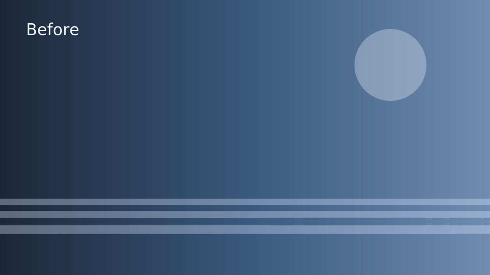
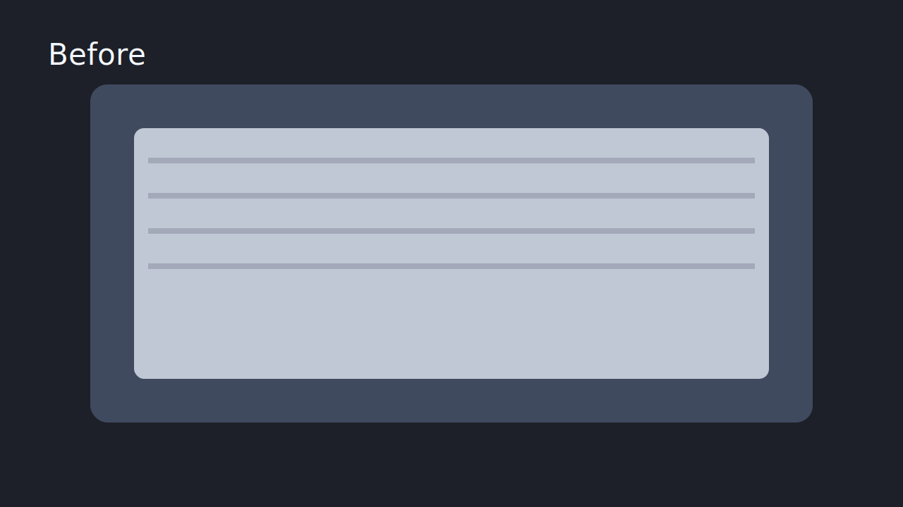
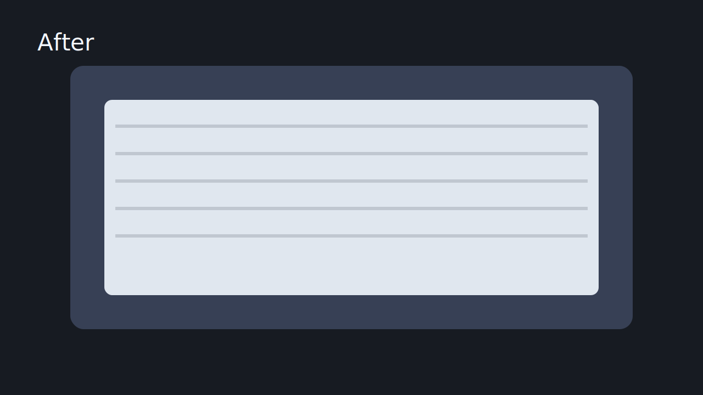

# Magic Compare Web

[English](./README.md) | [简体中文](./README.zh-CN.md)

<p align="center">
  <strong>Compare image changes with three focused review modes</strong>
</p>
<p align="center">
  Built for encoding-group review workflows with a fast path from local imports to published static compare pages.
</p>
<p align="center">
  <a href="#quick-start">Quick Start</a> ·
  <a href="#workflow-overview">View Workflow</a> ·
  <a href="./tools/uploader/README.md">Uploader Docs</a>
</p>

<table>
  <tr>
    <td width="33%" align="center">
      
      
      <br />
      <strong>Slider</strong>
      <br />
      <sub>Drag across before and after frames to inspect cleanup, texture recovery, and edge handling.</sub>
    </td>
    <td width="33%" align="center">
      
      
      <br />
      <strong>A/B</strong>
      <br />
      <sub>Flip between two versions to check decisions frame by frame without leaving the viewer.</sub>
    </td>
    <td width="33%" align="center">
      
      <br />
      <strong>Heatmap</strong>
      <br />
      <sub>Highlight difference regions and change intensity when a direct visual diff needs more emphasis.</sub>
    </td>
  </tr>
</table>

Magic Compare Web is a monorepo for an image compare platform aimed at encoding groups.

The project has two deployment targets:

- `internal-site`: a server-backed Next.js app for the internal catalog, case workspace, compare viewer, reorder operations, publish operations, public export, and Pages deploy.
- `public-site`: a static export target that consumes published artifacts from `content/published`.

This repository is deliberately not a video previewer, not an online VapourSynth runner, and not an in-site review/comment system. The current scope is "look" and "publish".

## ✨ Highlights

- `Slider` for before/after inspection on the same frame.
- `A/B` for direct version toggling during image review.
- `Heatmap` for difference emphasis when visual deltas need extra contrast.
- An internal import-to-publish workflow that turns local image sets into reviewable cases.
- A static public delivery target that reads published bundles from `content/published`.
- S3-compatible internal asset storage with uploader direct upload.
- Explicit public export and Cloudflare Pages deploy actions from the internal workspace.

<a id="quick-start"></a>

## 🚀 Quick Start

```bash
cp .env.example .env
docker compose up -d rustfs rustfs-init
pnpm install
pnpm db:push
pnpm db:seed
pnpm public:export

# terminal 1
pnpm dev:internal

# terminal 2
pnpm dev:public
```

Local entry points:

- internal site: `http://localhost:3000`
- public site: `http://localhost:3001`
- demo public page: `http://localhost:3001/g/demo-grain-study--banding-check`

Demo content:

- internal case slug: `demo-grain-study`
- internal group slug: `banding-check`
- public group slug: `demo-grain-study--banding-check`

💡 Note:

- `pnpm db:push` currently runs `apps/internal-site/prisma/init-db.ts` because `prisma db push` fails in the current local environment.

## 🐳 Docker and Storage

- `docker/internal-site.Dockerfile` builds a full-workspace internal-site image that can also trigger public export and Pages deploy.
- `docker-compose.yml` wires together:
  - `internal-site`
  - `rustfs` as the S3-compatible object store
  - `rustfs-init`, a lightweight `minio/mc` bootstrapper that ensures the bucket exists on startup
  - `internal-site-init`, a one-off initializer that runs `db:push` and `db:seed` before the app starts
- server-side Docker deployment now only needs:
  - `docker-compose.yml`
  - `.env`
  - the published runtime image
- the base Compose file now defaults to the GHCR runtime image via `MAGIC_COMPARE_INTERNAL_SITE_IMAGE`, so servers can `docker compose up` without a local build step
- the base Compose file now uses Docker named volumes, so a server can run it without depending on repository-relative `docker-data` paths
- if you want a local image build plus inspectable bind mounts during development, add `-f docker/dev.compose.override.yml`
- for local development, prefer the root scripts: `pnpm docker:dev:up`, `pnpm docker:dev:down`, `pnpm docker:dev:logs`
- the bundled local object-storage container now uses fixed runtime defaults; if you need to change its ports or runtime flags, edit `docker-compose.yml` directly
- internal assets now live in S3-compatible storage configured by `MAGIC_COMPARE_S3_*`
- published bundles still live under `MAGIC_COMPARE_PUBLISHED_ROOT`
- static public exports are mirrored into `MAGIC_COMPARE_PUBLIC_EXPORT_DIR`

<a id="workflow-overview"></a>

## 🔄 Workflow Overview

### 📥 Import Workflow

1. Prepare a local case directory that matches the uploader convention.
2. Run the uploader to validate required files and scan the source set.
3. Upload source images, generated thumbnails, and generated heatmaps into S3-compatible storage.
5. Build an `ImportManifest` and post it to `POST /api/ops/import-sync`.
6. Let the internal site upsert case and group metadata, then recreate replaced frame and asset rows from the manifest.

Result:

- imported review data is available in the internal site workspace
- internal assets live in S3-compatible storage; the database keeps logical `/internal-assets/...` paths while browser-facing URLs resolve from `MAGIC_COMPARE_S3_PUBLIC_BASE_URL`
- detailed uploader usage lives in `tools/uploader/README.md`
- a Chinese note about the difference between built-in demo content and real case/group flows lives in `docs/demo-vs-real-case-flow.zh-CN.md`

### 📦 Publish Workflow

1. Trigger `POST /api/ops/case-publish` from the internal site.
2. Filter `group.isPublic`, `frame.isPublic`, and `asset.isPublic` for the selected case.
3. Derive or reuse a stable `publicSlug` for each public group.
4. Write a `manifest.json` with `schemaVersion` and absolute public S3 image URLs for each published group.
6. Trigger `pnpm public:export` or `POST /api/ops/public-export` when you want a fresh static public bundle.
7. Trigger `pnpm public:deploy` or `POST /api/ops/public-deploy` when you want a direct Cloudflare Pages upload.

Result:

- published artifacts live under `content/published`
- `apps/public-site` consumes those artifacts as static content
- the public deployment target stays read-only

## ✅ What Works Now

The repository is fully bootstrapped and verified:

- `pnpm install` works.
- `pnpm db:push` initializes the SQLite schema.
- `pnpm db:seed` seeds a demo case into the internal database and uploads demo internal assets to S3-compatible storage.
- `pnpm public:export` builds the static public bundle into `dist/public-site` by default.
- `pnpm build` succeeds for both Next.js apps.
- `pnpm test` succeeds for shared schema and viewer logic tests.

The seeded demo case is:

- Internal site case slug: `demo-grain-study`
- Internal group slug: `banding-check`
- Public group slug: `demo-grain-study--banding-check`

## 🧱 Monorepo Layout

```text
apps/
  internal-site/
  public-site/

packages/
  compare-core/
  content-schema/
  shared-utils/
  ui/

tools/
  uploader/

content/
  published/
```

## 🧠 Technical Details

<details>
<summary><strong>🏗️ Architecture Notes</strong></summary>

### apps/internal-site

Internal site responsibilities:

- show the case catalog
- show a case workspace
- show the internal group viewer
- accept import manifests from the uploader
- reorder groups within a case
- reorder frames within a group
- publish public artifacts into `content/published`
- export and deploy the public static site on demand

Key implementation areas:

- `app/`: Next.js App Router routes
- `components/`: internal-only UI such as the case directory and workspace list
- `lib/server/repositories/`: read/write data access backed by Prisma client
- `lib/server/publish/`: publish pipeline that filters public content and writes manifests
- `lib/server/storage/`: S3-backed internal asset helpers and published artifact writers
- `lib/server/public-site/`: runtime public export and Pages deploy helpers
- `prisma/schema.prisma`: Prisma data model
- `prisma/init-db.ts`: SQLite schema bootstrap script used by `pnpm db:push`

### apps/public-site

Public site responsibilities:

- statically export published group pages
- read only from `content/published/groups/*/manifest.json`
- expose no catalog, no upload UI, and no write APIs

Key implementation areas:

- `app/g/[publicSlug]/page.tsx`: SSG/static-export group viewer entry
- `lib/content.ts`: published manifest reader

### packages/content-schema

Shared Zod schemas and TypeScript types for:

- case
- group
- frame
- asset
- import manifest
- publish manifest
- enums such as `CaseStatus`, `ViewerMode`, and `AssetKind`

Important current rule:

- internal `slug` values use kebab-case with single hyphens
- public `publicSlug` values allow double hyphen separators such as `case--group`

### packages/compare-core

Shared viewer logic:

- viewer dataset shape
- asset lookup helpers
- available mode calculation
- heatmap fallback resolution
- client-side viewer controller state

### packages/ui

Shared viewer workbench and theme:

- dark modern MUI theme
- group viewer shell
- top toolbar
- main stage
- filmstrip rail
- right sidebar

### tools/uploader

Python CLI that:

- validates a local case directory
- uploads source images and thumbnails into S3-compatible internal asset storage
- generates thumbnails
- builds an import manifest
- posts the manifest to `POST /api/ops/import-sync`

There is a dedicated uploader document at `tools/uploader/README.md`.

</details>

<details>
<summary><strong>🗂️ Data Model</strong></summary>

The current implementation uses four content entities.

### Case

Case is the top-level container.

Fields:

- `id`
- `slug`
- `title`
- `subtitle`
- `summary`
- `tags[]`
- `status`
- `coverAssetId`
- `publishedAt`
- `updatedAt`

### Group

Group is the smallest public sharing unit.

Fields:

- `id`
- `caseId`
- `slug`
- `publicSlug`
- `title`
- `description`
- `order`
- `defaultMode`
- `isPublic`
- `tags[]`

### Frame

Frame is one position in the filmstrip. A group can contain multiple frames.

Fields:

- `id`
- `groupId`
- `title`
- `caption`
- `order`
- `isPublic`

### Asset

Asset is one concrete image variant attached to a frame.

Fields:

- `id`
- `frameId`
- `kind`
- `label`
- `imageUrl`
- `thumbUrl`
- `width`
- `height`
- `note`
- `isPublic`
- `isPrimaryDisplay`

Current semantic rules:

- `before` and `after` are required for every frame
- `before` and `after` are the default primary display assets
- `heatmap` is optional
- `crop` and `misc` are optional

</details>

<details>
<summary><strong>🛣️ Routing</strong></summary>

### Internal site

- `/`
- `/cases/[caseSlug]`
- `/cases/[caseSlug]/groups/[groupSlug]`
- `POST /api/ops/import-sync`
- `POST /api/ops/group-reorder`
- `POST /api/ops/frame-reorder`
- `POST /api/ops/case-publish`

### Public site

- `/g/[publicSlug]`

The public site intentionally has no index page.

</details>

<details>
<summary><strong>🖼️ Viewer Behavior</strong></summary>

The shared viewer layout follows the agreed workbench structure:

- top lightweight toolbar
- central main stage
- bottom filmstrip rail
- collapsible right sidebar

Supported v1 viewer modes:

- `before-after`
- `a-b`
- `heatmap`

Current heatmap degradation rules:

- if a frame has no heatmap asset, the public site hides the heatmap entry
- on the internal site, heatmap is shown as unavailable through state and sidebar information
- if the current frame does not support heatmap, viewer mode falls back to `group.defaultMode`
- if `group.defaultMode` also depends on heatmap, the final fallback is `before-after`

Keyboard support currently includes:

- left and right arrow for frame navigation
- `1` for before/after
- `2` for A/B
- `3` for heatmap
- `i` for sidebar toggle

</details>

<details>
<summary><strong>📥 Detailed Import Flow</strong></summary>

The current import flow is local-processing + S3 upload.

1. A local case directory is prepared according to the uploader convention.
2. The uploader scans the directory and validates required files.
3. The uploader uploads source images, thumbnails, and generated heatmaps into S3-compatible storage.
5. The uploader builds an `ImportManifest`.
6. The uploader posts the manifest to `POST /api/ops/import-sync`.
7. The internal site upserts case/group metadata, deletes existing frame/asset rows for replaced groups, and recreates them from the manifest.

</details>

<details>
<summary><strong>📦 Detailed Publish Flow</strong></summary>

The current publish flow is explicit and case-scoped.

1. Internal site calls `POST /api/ops/case-publish`.
2. The publish pipeline loads the full case and filters `group.isPublic`, `frame.isPublic`, and `asset.isPublic`.
3. Each public group gets a stable `publicSlug`. If it does not exist yet, it is derived from `caseSlug--groupSlug`. Collisions add a short suffix.
4. A `manifest.json` with `schemaVersion` and absolute public S3 image URLs is written for each published group.
6. `pnpm public:export` builds a fresh static public bundle and mirrors it into `MAGIC_COMPARE_PUBLIC_EXPORT_DIR`.
7. `pnpm public:deploy` optionally uploads that bundle to Cloudflare Pages through Wrangler.

Important current rule:

- a public frame without both `before` and `after` causes publish to fail

</details>

<details>
<summary><strong>🛠️ Local Development Details</strong></summary>

### 1. Install dependencies

```bash
pnpm install
```

### 2. Initialize SQLite

```bash
pnpm db:push
```

Note:

- `pnpm db:push` currently runs `apps/internal-site/prisma/init-db.ts`
- Prisma remains the runtime ORM
- this workaround exists because `prisma db push` itself fails in the current local environment

### 3. Seed demo content

```bash
docker compose up -d rustfs rustfs-init
pnpm db:seed
pnpm public:export
```

### 4. Start internal and public sites

In separate terminals:

```bash
pnpm dev:internal
pnpm dev:public
```

Suggested local URLs:

- internal site: `http://localhost:3000`
- public site: `http://localhost:3001` or another port if you launch it separately

</details>

<details>
<summary><strong>🧪 Build, Test, and Useful Commands</strong></summary>

| Task | Command |
| --- | --- |
| Build both apps | `pnpm build` |
| Run all tests | `pnpm test` |
| Run workspace type checks | `pnpm typecheck` |
| Start internal site | `pnpm dev:internal` |
| Start public site | `pnpm dev:public` |
| Initialize SQLite | `pnpm db:push` |
| Seed demo content | `pnpm db:seed` |
| Export public static site | `pnpm public:export` |
| Deploy public static site | `pnpm public:deploy` |

Build everything:

```bash
pnpm build
```

Run all tests:

```bash
pnpm test
```

Run workspace type checks:

```bash
pnpm typecheck
```

</details>

## 🧾 Demo Assets and Published Bundle

The repository includes a checked-in published demo bundle:

- `content/published/groups/demo-grain-study--banding-check/manifest.json`
- corresponding SVG assets in the same directory

This is used for:

- public-site static generation
- local verification of the publish artifact shape
- seed/bootstrap reference content

## ⚠️ Current Limitations

- Prisma migrations are not yet wired; SQLite bootstrap is currently implemented through a manual init script.
- The public site still consumes published artifacts from the same repository checkout before export.
- Cloudflare Pages deploy assumes an existing Pages project and Wrangler-compatible credentials.
- There is no browser-side upload UI in v1.
- There is no in-site discussion, scoring, annotation, or review workflow.

## 🔗 Related Docs

- [Uploader README](./tools/uploader/README.md)
- [VSEditor workflow guide (Simplified Chinese)](./docs/vseditor-workflow.zh-CN.md)
- [Demo vs real case/group flow (Simplified Chinese)](./docs/demo-vs-real-case-flow.zh-CN.md)
- [Chinese root README](./README.zh-CN.md)

## 🛣️ Roadmap

- add a proper migration workflow once the Prisma schema engine issue is resolved in this environment
- move internal assets from app public storage to object storage or a dedicated managed path
- add richer error reporting for reorder and publish failures in the UI
- add end-to-end tests around internal reorder and publish flows

## 📄 License

Released under the [MIT License](./LICENSE).
